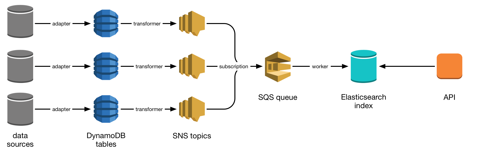

calm-ingest
===========

This directory contains some rudimentary Python scripts to help ingest
Calm data.

Ingest process
**************

This diagram displays the current ingest architecture:

We have a number of data sources (initially just Calm, but we'll add others).
An adapter ingests all the records into a per-source DynamoDB table, treating
Dynamo as a mirror of the original source.

A transformer runs on the other side of Dynamo, and parses out the fields we
want to expose on Elasticsearch.  It pushes JSON objects onto a queue (or sends
records to a DLQ if they cannot be parsed), which is read by a worker to ingest
those fields into our Elasticsearch index.  All records are stored in the same
Elasticsearch index, regardless of source.

Our API then queries Elasticsearch directly.

Installation
************

These scripts require Python 3.  To install dependencies:

.. code-block:: console

   $ python3 -m venv env
   $ source env/bin/activate
   $ pip install -r requirements.txt

Usage
*****

Once you have the requirements installed, the ingest is a two-step process:

1. Given an XML export file from Calm, push the records into DynamoDB:

   .. code-block:: console

      $ python3 calm_to_dynamodb.py /path/to/calm_export.xml
