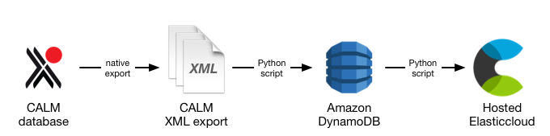

calm-ingest
===========

This directory contains Python scripts for ingesting Calm data.

Ingest process
**************

For the proof-of-concept, we're searching records from the Calm database.

The data is provided as an XML dump of the entire database via the native
export function.  This repo includes a script that pushes every record into a
DynamoDB table.  We then have a second script that creates an Elasticsearch
index for the data, which will be used by the API for searching.

Having an intermediate data store in DynamoDB means we can change the
Elasticsearch mappings without having to re-ingest the entire Calm database.

Calm presents an API, and we may use this API in a future version and/or
for updating the data after the initial ingest.

Installation
************

These scripts require Python 3.  To install dependencies:

.. code-block:: console

   $ python3 -m venv env
   $ source env/bin/activate
   $ pip install -r requirements.txt

Usage
*****

Once you have the requirements installed, the ingest is a two-step process:

1. Given an XML export file from Calm, push the records into DynamoDB:

   .. code-block:: console

      $ python3 calm_to_dynamodb.py /path/to/calm_export.xml
