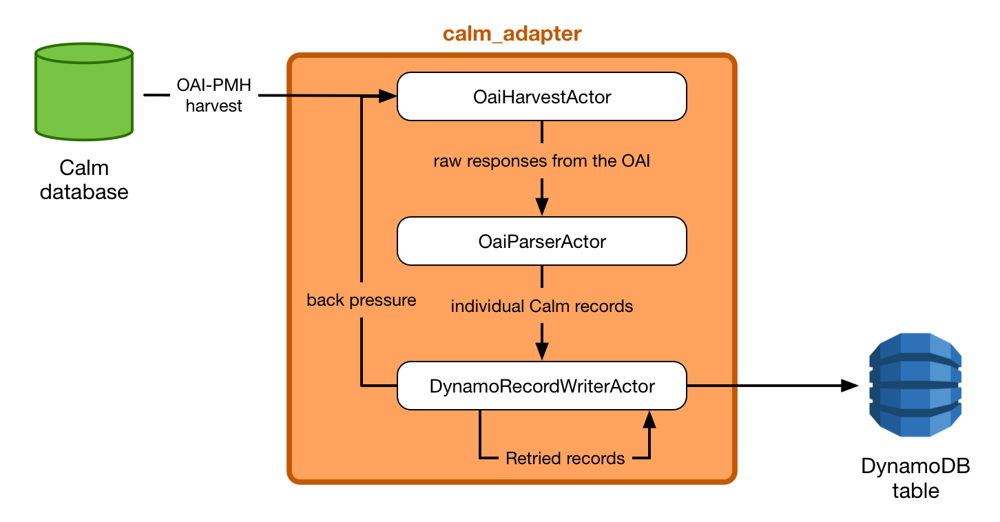

# calm_adapter

The Calm adapter reads Calm records from our OAI instance, and pushes them
into DynamoDB.

As with our other applications, it's a Finatra web app with the actor model.
This is the architecture:

## Background

The Calm database has an [OAI-PMH interface][oai]:

> The **Open Archives Initiative Protocol for Metadata Harvesting (OAI-PMH)**
> is a low-barrier mechanism for repository interoperability. *Data Providers*
> are repositories that expose structured metadata via OAI-PMH.

In practical terms, this means we can download all the records from the
Calm database by making repeated requests to an HTTP endpoint, which in our
case is <http://archives.wellcomelibrary.org/oai/oai.aspx>.

The adapter grabs all these records, and puts them into DynamoDB.

[oai]: https://www.openarchives.org/pmh/

## Internal architecture

We have three actors:

*   The *OaiHarvestActor* is responsible for making HTTP requests to the
    OAI-PMH.  Assuming the request is successful, it passes the response body
    directly to the next actor.

    Each page of results from the OAI-PMH includes a [resumption token][token]
    that you use to get the next page of results – the harvest actor is
    responsible for extracting this token, and using it to start the next
    request.

*   The *OaiParserActor* gets the response bodies (strings), and parses out
    the individual records.  It wraps these in a `CalmDynamoRecord` case class,
    and passes the parsed records on to the next actor.

*   The *DynamoRecordWriterActor* gets the `CalmDynamoRecord` instances, and
    tries to write them to DynamoDB.

    The OAI-PMH may return records faster than we can write them to Dynamo: we
    may get "write provision exceeded" errors in this actor.  If that happens,
    the actor sends the record to its own queue for retrying, and also sends
    a signal to the *OaiHarvestActor* telling it to slow down.  This is meant
    to prevent the application buffering too many records and running out
    of memory.

[token]: http://www.openarchives.org/OAI/2.0/guidelines-harvester.htm#resumptionToken
