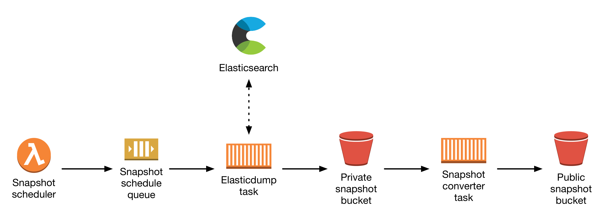

# data_api

This directory contains infrastructure and applications providing services for `data.wellcomecollection.org`.

## Overview

`data.wellcomecollection.org` provides large data sets from Wellcome to the public.

## Architecture

Last updated 12 March 2018.

*   A **snapshot scheduler Lambda** wakes up once a day, and sends a message
    to the **snapshot schedule queue**.

*   The **Elasticdump task** reads messages from this queue, talks to
    Elasticcloud and writes a snapshot to a private S3 bucket.  These snapshots
    are dated, and include everything in Elasticsearch, including invisible
    Works.

*   The **Snapshot converter task** is triggered by the event stream from
    this bucket (possibly with an intermediate SQS queue).  It reads the
    snapshot, filters out invisible works, and writes another snapshot with
    DisplayWorks to a public bucket.
