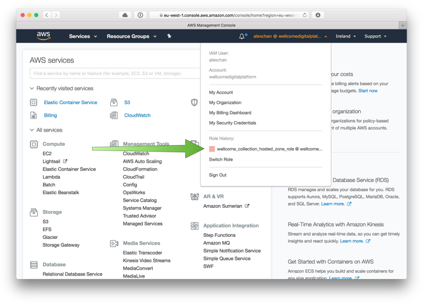
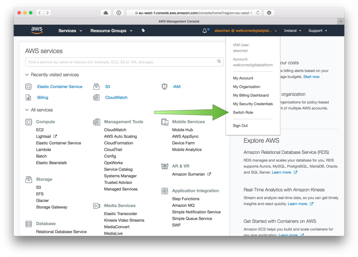
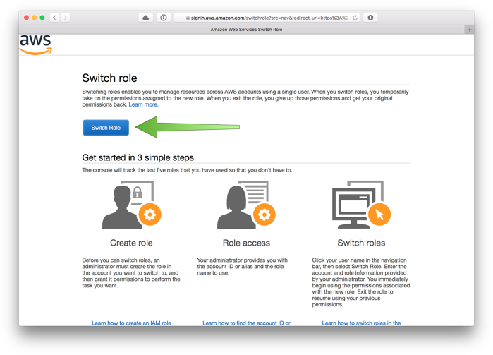
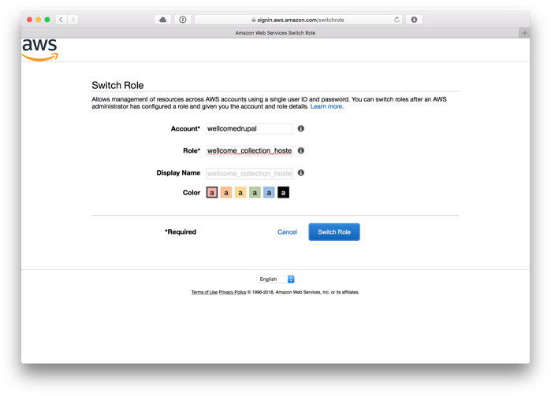
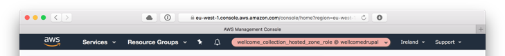
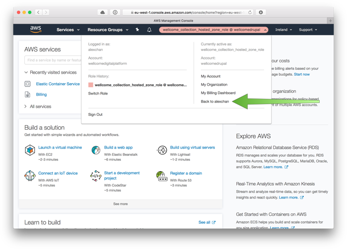

# Modifying Route 53 hosted zones

The main account for the Platform apps is *wellcomedigitalplatform*.

The DNS entries for wellcomecollection.org are managed by *wellcomedrupal*.

If you want to edit DNS for wc.org, you'll need to use a shared IAM role.

---

You'll need to be logged into your Platform account first.

In the AWS Console, click the account dropdown menu in the top right.
This is labelled something like *alexchan @ wellcomedigitaplatform*.

If you see the Hosted Zone role in your role history, you can click that and access it immediately:

If not:

1.  In the AWS Console, select the account dropdown menu in the top right.
    This is labelled something like *alexchan @ wellcomedigitaplatform*.

    Click **Switch Role**.

    

2.  On the next screen, click the blue button **Switch Role**.

    

3.  On the next screen, you're prompted to enter configuration for the role.

    -   Account: **wellcomedrupal**
    -   Role: **wellcome_collection_hosted_zone_role**

    Enter the required fields, choose a display name (optional), then click **Switch Role**.

    

4.  If that succeeds, you'll be logged into your new role.
    You'll notice the top bar now has the name of your new shared role:

    

5.  To get back to your regular console, click the user menu, and select the "Back to" option, e.g. **Back to alexchan**.

    
