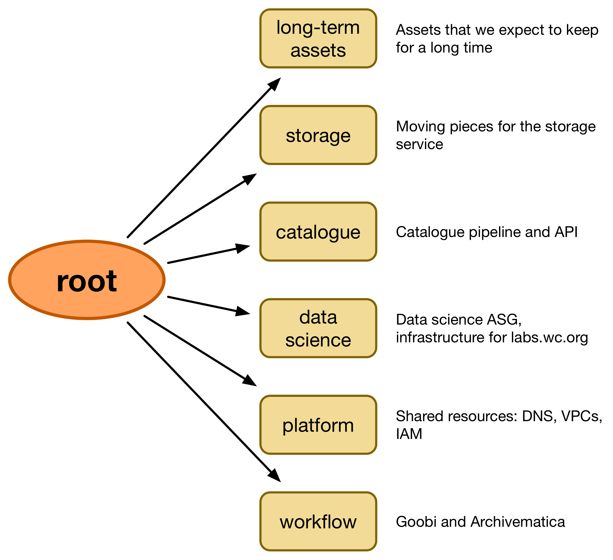

# RFC 009: AWS account setup

**Last updated: 6 December 2018.**

## Problem statement

We want to break up the monolithic "wellcomedigitalplatform" AWS account, and replace it with a series of smaller accounts.

We want to:

*   **Make it harder to make mistakes** (e.g. somebody with admin credentials accidentally deleting long-term assets)
*   **Make it easier to give access to a subset of resources** (e.g. access to the editorial-photography S3 buckets for the Digital Production team)
*   **Have combined billing**

## Proposed solution

We create an AWS organisation with sub-accounts.

These are the sub-accounts we're planning to create initially:

Everybody who needs to work in AWS gets a user account in the root (which only contains the users), and then assumable roles for each of the sub-accounts.

Every sub-account has the following assumable roles:

*   Dev/superuser
*   Read-only
*   Budget (can only view budgets/billing)

We may create extra roles.

The assumable roles help reduce mistakes, because our default day-to-day credentials won't be able to perform as many destructive operations.

These roles/accounts will be managed entirely in Terraform, stored in a private GitHub repo.

All accounts need 2FA, and we need a password store for the root account passwords.

Hardware MFA devices will be used.