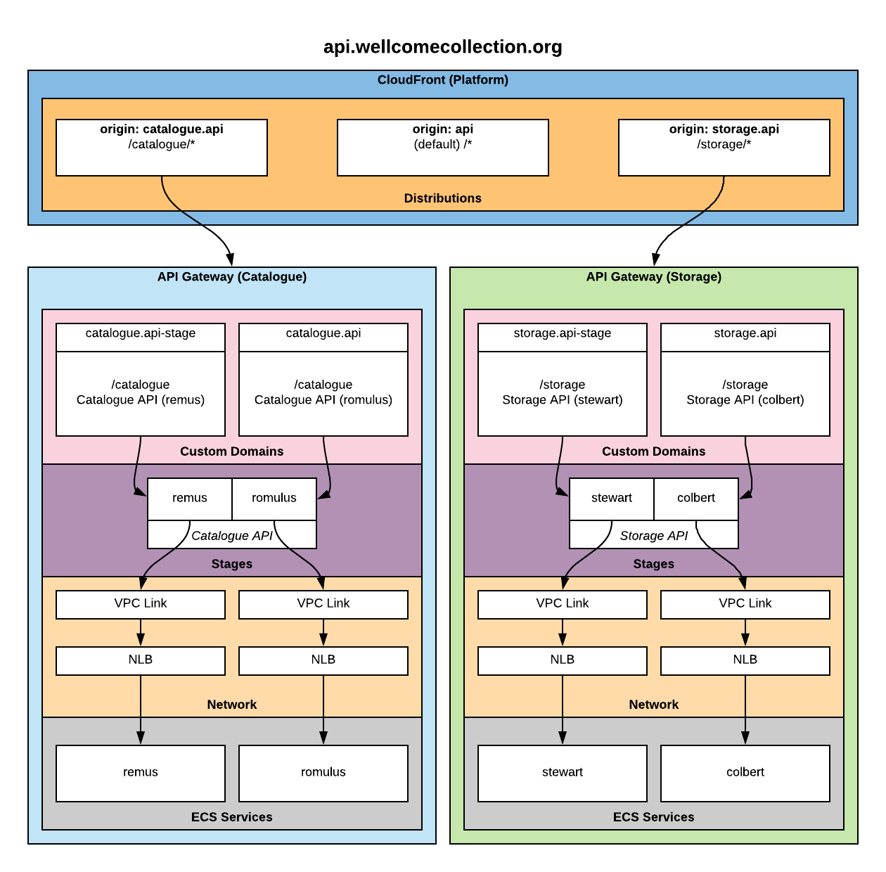

# RFC 011: API Architecture

**Last updated: 09 January 2019.**

## Background

Wellcome Collection provides multiple APIs to interact with our data. A single API can be made up of multiple services, providing responses at different endpoints.

Some API endpoints require authentication, while others are public and would benefit from rate limiting.

## Problem statement

In order to provide a consistent location for Wellcome Collection APIs we'd like to serve all APIs from [api.wellcomecollection.org](https://api.wellcomecollection.org).

As of 09/01/2019 we are focusing on serving the `storage` and `catalogue` APIs from `api.wellcomecollection.org`. The `storage` API requires authentication, the catalogue API does not.

We are using [AWS API Gateway](https://aws.amazon.com/api-gateway/) to host our REST APIs and making use of a [private integration](https://docs.aws.amazon.com/apigateway/latest/developerguide/set-up-private-integration.html) to serve requests via an [AWS ECS Service](https://aws.amazon.com/ecs/).

We wish to segregate infrastructure projects into different AWS accounts for simplicity and security. See [RFC: 009-aws_account_layout](../009-aws_account_layout/README.md).

Currently it is not possible to point a [Custom Domain](https://docs.aws.amazon.com/apigateway/latest/developerguide/how-to-custom-domains.html) from one account to another account using API Gateway.

## Proposed Solution

The recommended solution is to use an [AWS CloudFront Distribution](https://docs.aws.amazon.com/AmazonCloudFront/latest/DeveloperGuide/distribution-working-with.html) to field requests to `api.wellcomecollection.org` and then use [Custom Origins](https://docs.aws.amazon.com/AmazonCloudFront/latest/DeveloperGuide/DownloadDistS3AndCustomOrigins.html#concept_CustomOrigin) to serve requests from API Gateway in other accounts using their own Custom Domains.

See:

