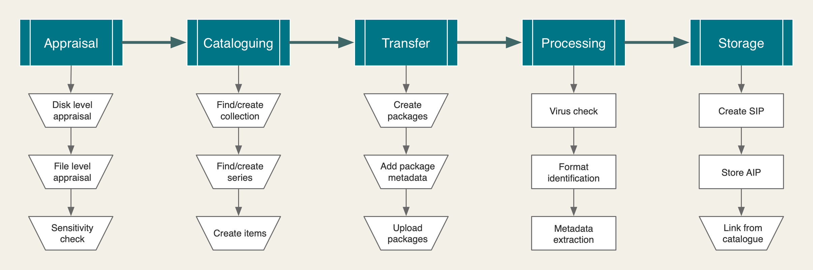

# RFC 014: Born digital workflow

**Last updated: 10 June 2019.**

## Background

As part of the move to our new [storage service](https://github.com/wellcometrust/platform/tree/master/docs/rfcs/002-archival_storage), we will be adopting [Archivematica](https://www.archivematica.org) to manage the preservation workflow for born-digital archives. This is analogous to our use of [Goobi](https://www.intranda.com/en/digiverso/goobi/goobi-overview/) for managing digitisation workflows.

This document describes an initial workflow that will allow us to start using Archivematica as soon as possible. This means that, for now, we will continue to perform some parts of the workflow manually, outside of Archivematica.

We will be actively contributing to the development of Archivematica, including ensuring that it better addresses our needs around appraisal and cataloguing. This will mean we are able to streamline the workflow over time, as the amount of born-digital material increases.

## Proposed solution

### Principles

There are three key principles underlying this initial workflow:

- Appraisal and selection will remain manual until the functionality in Archivematica improves
- Cataloguing will be done in Calm and file-level description will not be part of the catalogue record
- All processing steps within Archivematica will be fully automated and require no intervention

### Overview

The workflow consists of the following high-level stages:

1. Appraisal
2. Cataloguing
3. Transfer
4. Processing
5. Storage

Each of these are described below.

### Appraisal

During the appraisal stage, an archivist will determine which files are in scope for the collections and perform a policy-led sensitivity check. We intend to move towards system-assisted appraisal, using future version of Archivematica, but for now this stage will build on existing manual processes.

| Step                 | Description |
|----------------------|-------------|
| Disk level appraisal | High level appraisal to determine what storage media is in scope. |
| File level appraisal | Selection of in scope files from selected storage media. |
| Sensitivity check    | Policy-led review of selected files to determine whether they contain sensitive material. |

### Cataloguing

Once an initial appraisal has been completed, the files in scope for archiving need to be arranged into archive items and catalogued in Calm. Items should be created in Calm to represent each related set of files, which will be submitted and stored as a single package in the storage service.

This means that an item in Calm corresponds to a bag in the storage service, not an individual file. File-level description is fully automated and the metadata generated is stored in a METS file created by the Archivematica processing workflow.

| Step                   | Description |
|------------------------|-------------|
| Find/create collection | Find, or create if necessary, the collection in Calm that the items will be part of. |
| Find/create series     | Find, or create if necessary, the series and sub-series within the collection that the items will be part of. |
| Create items           | For each set of related files, create an item in Calm that represents and describes them collectively in the catalogue. This should describe the files as a set, not list details of individual files. |

### Transfer

Once each set of related files as been identified, they need to be assembled into a package that can be transferred into Archivematica for processing and storage. This package is a simple zip file, with the addition of a minimal set of descriptive metadata.

This metadata is used for identification only. The canonical version of the metadata, which is also the data that will be displayed to end users, remains the data in Calm. Similarly, whilst Archivematica does have support for rights information, we will not be supplying this through the workflow. Calm will be the sole location for rights information.

The package created for transfer into Archivematica should reflect the original order of the files, as this structure will be maintained in the storage service and in the file-level metadata presented to users.

The zip file should have the following structure:

	PPABC_1234.zip
	|-- file1.txt
	|-- file2.doc
	|-- file3.jpg
	|-- folder1
	    \-- [...] 
	|-- folder2
	    \-- [...] 
	|-- [...]
	\-- metadata
	    \-- metadata.csv

 Note the addition of a `metadata` directory, with a single file named `metadata.csv`, which contains item level metadata from Calm. `metadata.csv` should have the following structure:

	filename,dc.title,dc.creator,dc.date,dc.identifier
	objects,<Title>,<CreatorName>,<Date>,<AltRefNo>

Once the zip files have been created, they need to be uploaded to AWS S3. As soon as the upload of a zip completes, it should be picked up by Archivematica and a processing workflow started automatically.

Access to S3 requires the installation of a client application. Until this can be made available more widely, zip files should be passed to the Digital Production team for upload to S3.

| Step                 | Description |
|----------------------|-------------|
| Create packages      | Move the set of files for each item into its own directory, preserving the original order. |
| Add package metadata | Add a `metadata.csv` file to each item, inside a directory called `metadata`. This file should include the appropriate item level metadata from Calm. |
| Upload packages      | Create a separate zip file from the parent directory for each item and upload to AWS S3, via the Digital Production team. |

### Processing

- how transfers are started in archivematica
- automation settings in archivematica

| Step                  | Description |
|-----------------------|-------------|
| Virus check           |  |
| Format identification |  |
| Metadata extraction   |  |

#### Processing configuration

This will be a fully automated workflow configured as follows:

| Setting                                           | Value    |
|---------------------------------------------------|----------|
| Assign UUIDs to directories                       | No       |
| Send transfer to quarantine.                      | No       |
| Remove from quarantine after (days).              | 28       |
| Generate transfer structure report                | No       |
| Perform file identification (Transfer)            | Yes      |
| Extract packages                                  | No       |
| Delete packages after extraction                  | No       |
| Perform policy checks on originals                | No       |
| Examine contents                                  | Yes      |
| Create SIP(s)                                     | Create single SIP and continue processing |
| Perform file format identification (Ingest)       | No, use existing data |
| Normalize                                         | Normalize for preservation and access |
| Approve normalization                             | Yes      |
| Generate thumbnails                               | No       |
| Perform policy checks on preservation derivatives | No       |
| Perform policy checks on access derivatives       | No       |
| Bind PIDs                                         | No       |
| Document empty directories                        | No       |
| Reminder: add metadata if desired                 | Continue |
| Transcribe files (OCR)                            | No       |
| Perform file format identification command (Submission documentation & metadata) | No |
| Select compression algorithm                      | Gzipped tar |
| Select compression level                          | 5 - normal compression mode |
| Store AIP | Yes |
| Store AIP location | Wellcome AIP Storage |
| Upload DIP | Do not upload |
| Store DIP | Do not store |
| Store DIP location | Default location |

### Storage

Where things end up

| Step                | Description |
|---------------------|-------------|
| Create SIP          |  |
| Store AIP           |  |
| Link from catalogue |  |

## Future enhancement

Appraise in Archivematica
Pull metdata from calm
Pull rights from calm
Create package in Archivematica

### Metadata

- annex: ideal way we will work towards to do metadata

### Appraisal

- annex: how we will towards improving appraisal eg ML