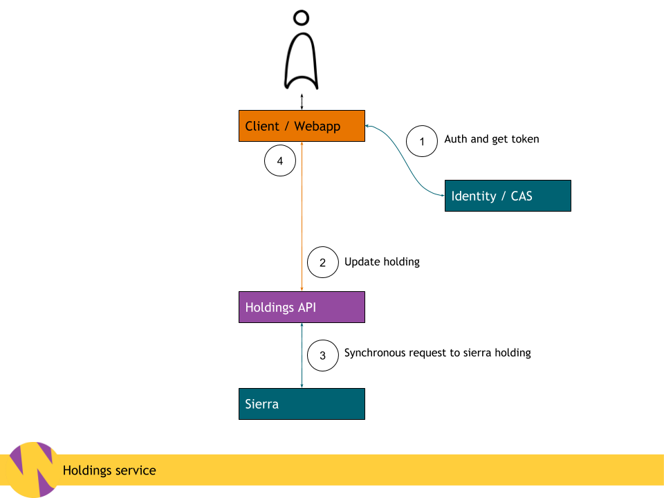

# **RFC 016: Holdings service**

- Status: 🚧 Draft 🚧
- Last updated: 24 September 2019.

## Glossary

- Holding: TBD
- Availability: TBD
- ...TBD

## Motivation

To create a public service to request and retrieve items from our collection
based on current and evolving requirements in a performant, scalable, and
undisruptive manner.

## Background

As we move a greater proportion of people over from wellcomelibrary.org to
wellcomecollection.org we need to provide a service allowing people to query on
and request items based on their availability and
location, whether it be online, in the library, or something else.

This document will outline the different services we will need build and
integrate with.

We will explore the best way to start developing the service and get it to
people for research and testing as quickly as possible, without losing sight of
the fact that this service will need to integrate with Sierra, CAS and other
services while containing other integral pieces of infrastructure.

We will also assume that we will not be disrupting any current processes across
teams outside of the digital platform, or adding more places for library members
to manage their relationship with us (i.e. account information).

The project will most likely be a cross team (experience / data / preservation)
endeavour, so the process in how we communicate and share what we are doing will
be important too.

## **Proposed solution**



### Client (Experience)

At first the client would make calls to a separate Holdings API and
progressively enhance the page as we would not want to block rendering of the
integral catalogue information, nor could we rely on the consistency of the data
with Sierra, at least at first. See data principles below.

### Identity (TBD)

Requests will need to be authenticated and identified through the current
identity service, CAS, as we will need to update Sierra with requests to not
disrupt the current workflow of library desk staff.

This authentication can happen as the first step and hopefully we will be able
to propegate a token through to the holdings API which will in turn us it to
authenticate with the sierra integration.

There is currently a process for setting up a new service with SSO where the
keys and knowledge sit with Digirati.

The client can integrate directly with this service.

We need to make sure we don't get sidelined into recreating a whole identity
management system as that is not in scope, but to integrate with what we have.

### Holdings API (Data)

There will be a public API that reflects the service as we would like it to be
going forward. This will also allow for rapid iteration on the API and client
while other parts of the service are being worked on.

It will also allow us to build on any missing parts that we arise through user
research as quick wins.

The design and implementation should also be in the shape of what the data team
would like to set as the standard for APIs going forward, including logging,
monitoring and reporting.

#### Design

`GET /works/{workId}/items`

```JS
{
  "totalResults": 10,
  "pageSize": 10,
  "totalPages": 1,
  "totalResults": 10,
  "results": [
    {
      "id": "{itemId}",
      "workId": "{workId}",
      "label": "Available",
      "status": "available"
    },
    {
      "id": "{itemId}",
      "workId": "{workId}",
      "label": "Unavailable",
      "status": "unavailable"
    },
    ...
  ]
}
```

`GET /works/{workId}/items/{itemId}`

```JS
{
  "id": "{itemId}",
  "workId": "{workId}",
  "label": "Available", // TBD: Glossary
  "status": "available" // TBD: Glossary
}
```

### Sierra integration (Preservation)

All requests will have to be updated within Sierra as this is the current system
used by library desk staff and people using the library, including services such
as "Items previously checked out", "Saved searches", "Saved Lists", and "My
bookmarks".

---

### **Principles**

- **Respect and iterate on the current shape of our data** Any client
  application and API design will be driven by the current shape of the
  catalogue API, and not other services such as Sierra. This is to allow closer
  integration of with the API in the future without having to go through large
  code refactors.
- **Scalability of features** The service should be built in such as way that we
  can add features based on requirements from user research that might not be
  available from the APIs that we integrate with.
- **Strongly consistent data with Sierra** Information displayed to the user
  will be strongly consistent with Sierra. This will probably mean a lot of
  synchronous calls to Sierra and waiting for those to complete, but as we have
  no way of letting a user no something eventually failed, we should avoid this
  at first.
- **Testable without interrupting current work flows** Any requests to the
  current holdings system on prod can land up with a significant amount fo work
  being created for library staff. We should make sure our systems accurately
  reflect the integrations and external APIs, but without creating any overhead
  for people using the current system.

---

## Alternatives

### Accessing the Sierra API and CAS directly

Build a proxy API that talks directly to the Sierra and CAS APIs.

#### Drawbacks

- Unable to add or change any feature specific to user requirements
- Would not conform to the new structure of our catalogue, namely works and
  items.

--

## Unanswered questions

- Do we just keep using the library application already setup in CAS?
- Should we use AKKA HTTP for the API?
- What is acceptable times when waiting on a response from Sierra?
