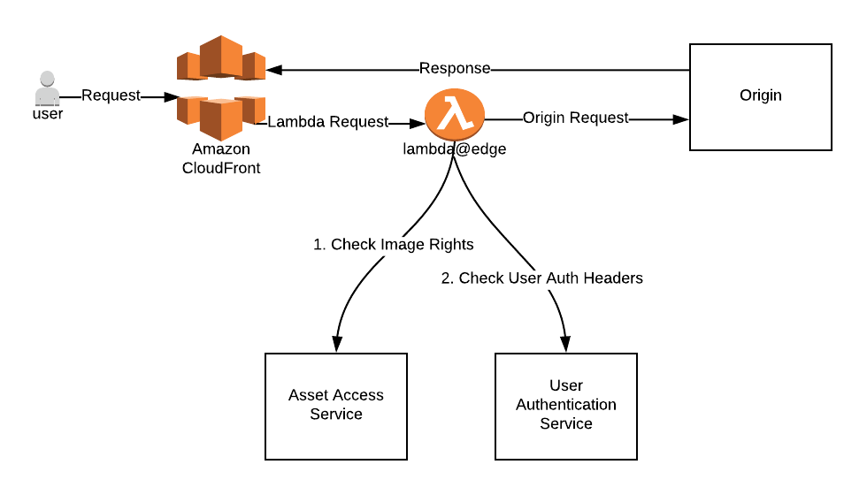
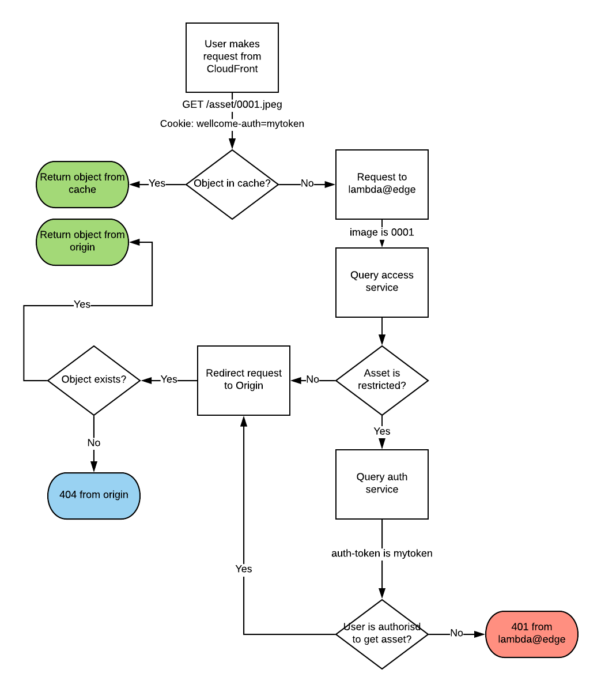

# RFC 3: Asset Access

**Last updated: 14 May 2018.**

## Background

Wellcome Collection digital assets are primarily publically accessible. In some cases there are restrictions on digital assets for items that are deemed sensitive (by virtue of law or public sensibility).

Restrictions on the availability of items can be broken down into multiple roles.

## Problem Statement

We need to restrict access for certain assets based on their access provisions and the authentication status / role of the viewer.

In addition we need to be able to serve these assets via a CDN (in our case CloudFront). This means not requiring sign-in for all users to prevent the cache varying on authentication tokens. The implication for users being that they will only be asked to sign in when accessing restricted assets.

### Images

Some digital assets served via the IIIF Image API compliant server [Loris](https://github.com/loris-imageserver/loris), are restricted and require authentication before viewing. The IIIF Image standard requires that image asset URLs follow the [described syntax](http://iiif.io/api/image/2.1/#canonical-uri-syntax).

## Suggested Solution

We propose to build an authentication solution based on introducing an origin-response [lambda@edge](https://docs.aws.amazon.com/lambda/latest/dg/lambda-edge.html) function.

### Process flow

The authentication flow is as follows:

