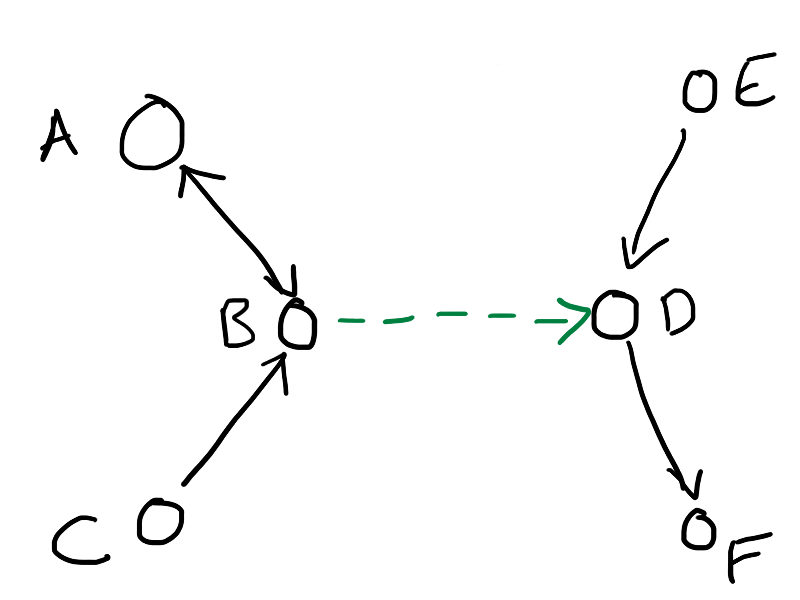
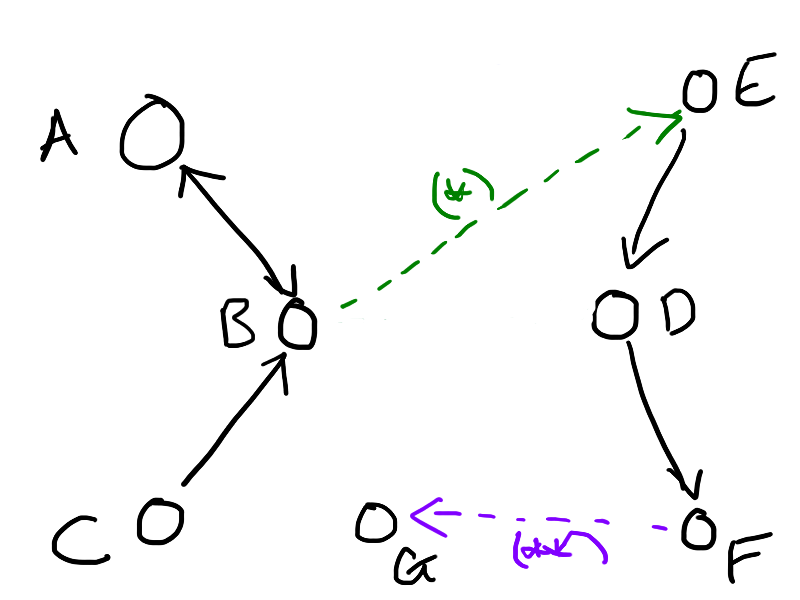
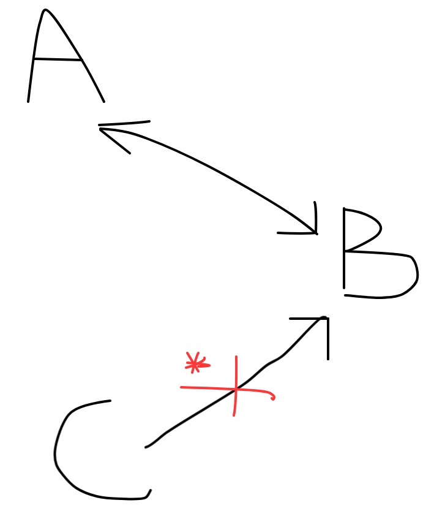

# RFC 1: Matcher architecture

**Last updated: 15 May 2018.**

## Background

Items can be closely related, for example a book may be both a printed book and an eBook, or a painting can include a physical painting and photographs or xray
imagery of the painting.
Where works are so closely related that they represent or refer to the same 'thing' we wish to 
merge them into combined works to aid understanding and searching.

## Problem Statement

Individual works can be merged to form larger combined works. Combined works can be later split.
Each individual work has a unique source identifier. The source identifier for the merged works will be one of the source
identifier of the original works that compose it.

The merging of works is broken into two phases

 * a matching phase that identifies groups of work to be merged.
 * a merging phase that merges works to form new combined works.
   
The matcher receives source identifiers for processed works along with source identifiers for works that should be merged,
and determines how they group together.

The merger takes transformed works and merges them into new combined works. This means that the merger needs a strategy for how to combine existing works into one.
Among other things it will choose which of the original source identifiers to use for the merged work.
The source identifiers that are not choosen for the merged work will redirect to the merged work.
The merger will put redirect information into those works.

## Proposed Solution

This document has notes on the proposed architecture.

## Model

A matching phase is introduced to determine where works need to be combined.

The input to this phase is the source identity for a work and a list of the identities that make up the combined work.
The output is groups of identifiers of affected works that will be combined downstream by the merger

Example:
```[json]
    {
        "work-groups": [
            {
                "identifiers": [
                    "sierra-system-number/b1234567",
                    "miro-image-number/V003456"
                ]
            },
            {
                "identifiers": [
                   "sierra-system-number/b876543"
                ]
            }
        ]
    }
```

## Storage

When the matcher receives an update for a work, it needs to know about previously seen works that referenced it to be able to group them together.
This implies storing each work that is sees, along to the group of nodes it belongs to at that point in time.
The group that each work belongs to should have an indentifier that is deterministic on the identifiers of the nodes that compose it.
The group identifiers should be never exposed outside the matcher.

Similarly, the matcher needs to be able to break connections if a link from one work to another is removed.
This mean storing, for each work, the list of works directly referenced.

## Database schema

The id used for combined works is created by concatenating the sorted, namespaced source idenfifiers of their components.
For example if a work A is edited to include work B this will be identified in the 'identifiers' field of A.

For example creating a combined work 'A-B' when processing work 'A' could give as input:
```javascript
{
  A.identifiers : [ 
    // A
    { 
      identifierScheme: 'sierra-system-number',
      ontologyType: 'Work',
      value: 's12345'
    },
    // B
    {
      identifierScheme: 'miro-image-number',
      ontologyType: 'Work',
      value: 's67890'
    }
  ]
}
```
Note that `A.identifiers` includes the source identifier for  `A` itself.
In the case that neither A or B has previously been identified as a part of a combined work the matcher
will output:
```[json]
{
  "work-groups": [
    {
      "identifiers": [ "sierra-system-number/s12345", "miro-image-number/s67890"]
    }
  ]
}
```

For example, suppose works `A`, `B`, and `A-B` have been previously created and `A` is 
edited to link to `C`, then the output from the matcher would be:
```javascript
{
  "work-groups": [
    { 
      identifiers: [ 'sierra/A', 'miro/B', 'sierra/C' ]
    }
  ]
}

```


## Concurrent updates and locking

While the required updates for a merged work are being found there cannot be changes to the records for participating 
works.
A locking mechanism is used to achieve this, with all participating works being locked for editing.

## Storage of combined works and locks

Use dynamoDB with a works and a lock table.

## Examples

The matcher is best understood with examples.

## Example 1

Suppose we have the following graph:



We have two existing works: ABC and DEF.
We receive an update to B telling us it now has edges B→A and B→D.

0.  The existing DB is as follows:

        work_id   | links | group_id
        A         | B     | ABC
        B         | A     | ABC
        C         | B     | ABC
        D         | F     | DEF
        E         | D     | DEF
        F         | -     | DEF


1.  Because we have an update that affects A, B and D, we read those rows from
    the database first:

        A     | B      | ABC
        B     | A      | ABC
        D     | F      | DEF

2.  By looking at their group id, we can do a second read to gather
    all the vertices that might be affected: ABCDEF.
    This gives us the database above, and enough to construct the entire graph
    we're interested in.

3.  Apply the changes, and work out what the new components are.  Write that
    back to the database.

        work_id   | links | group_id
        A         | B     | ABCDEF
        B         | AD    | ABCDEF
        C         | B     | ABCDEF
        D         | F     | ABCDEF
        E         | D     | ABCDEF
        F         | -     | ABCDEF

4.  The output JSON is:
```[json]
{
  "work-groups":[
    {
      "identifiers": [ "A", "B", "C", "D", "E", "F" ]
    }
  ]
}
```

## Example 2

What if we have two conflicting updates?

The graph of works is fairly sparse, and most of the time edits will either be
no-ops or affect entirely disconnected portions of the graph.

But let's suppose we have the following graph, and receive two updates that
overlap (deliberately not numbered as there's no ordering on updates to
different vertices).



0.  The existing DB is as follows:

            work_id   | links | group_d
            A         | B     | ABC
            B         | A     | ABC
            C         | B     | ABC
            D         | F     | DEF
            E         | D     | DEF
            F         | -     | DEF
            G         | -     | G

1.  Update (*) is processed, and it affects nodes B and E.
    So the worker handling (*) acquires a row-level lock on those two nodes.

    Meanwhile update (**) is also being processed, and it affects F and G.
    So the worker handling (**) F and G acquires a lock on those two rows.

            work_id   | links | group_id
            A         | B     | ABC
        *   B         | A     | ABC
            C         | B     | ABC
        *   D         | F     | DEF
        **  E         | D     | DEF
        **  F         | -     | DEF
            G         | -     | G
2.  Process (*) discovers that it affects vertices ABCDEF.

    Process (**) discovers that it affects vertices DEFG.

    Both of them attempt to expand to lock all the vertices they affect -- and
    whoever tries first will hit the other's lock.  They then release their
    lock, and allow the other update to proceed.

    The update will go back into the SQS queue, and will be retried until it
    can be applied conflict-free.

This results in an eventually consistent graph, which is as good as we can
guarantee.

3. Eventually the output JSON is:

```[json]
{
  "work-groups": [
    {
      "identifiers":[ "A", "B", "C", "D", "E", "F", "G"]
    }
  ]
}
```

## Example 3

What happens if we remove a link?



In this example A, B and C are connected into a component called ABC. We receive an update to C that causes ABC to be split.

0.  The existing DB is as follows:

            work_id   | links | group_id
            A         | B     | ABC
            B         | A     | ABC
            C         | B     | ABC

1.  Because we have an update that affects C, we read and acquire a lock on C from the database first:

            work_id   | links | group_id
            C         | B     | ABC

2.  By looking at their connected components, we acquire a lock on all other vertices affected: A and B.
3.  We update C to not belong to ABC:

            work_id   | links | group_id
            C         | _     | _

4.  We assign A and B to group_id AB:

            work_id   | links | group_id
            A     | B      | AB
            B     | A      | AB

5.  The database ends up looking like this:

            work_id   | links | group_id
            A         | B     | AB
            B         | A     | AB
            C         | _     | C

7.  The output JSON is:

```[json]
{
  "work-groups": [
    {
      "identifiers":[ "A", "B"]
    },
    {
      "identifiers": [ "C" ]
    }
  ]
}
```
