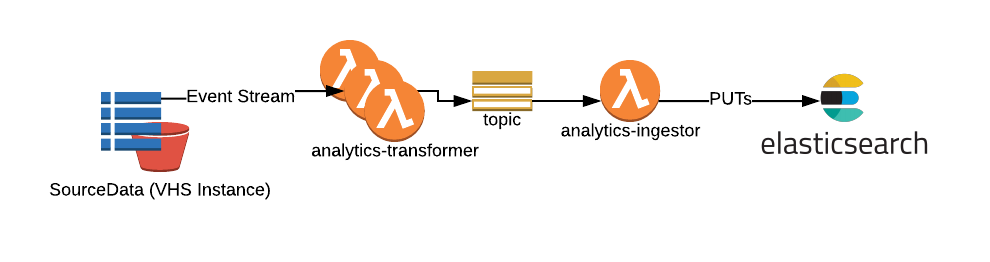

# RFC 5: Reporting Pipeline

**Last updated: 14 May 2018.**

## Background

The collection aggregates data from a number of sources:

- Archival records
- Library systems
- Digital asset metadata

Data will flow from these systems into our data store.

## Problem Statement

In order to make decisions about collection data.

We need to run analytics and reporting on data from various sources.

## Proposed Solution

We propose to add a simple reporting pipeline powered by lambda functions feeding an ElasticSearch cluster.



**Note:** [Kinesis Firehose](https://aws.amazon.com/blogs/aws/amazon-kinesis-firehose-simple-highly-scalable-data-ingestion/) is unsuitable for this purpose at time of writing as it is incapable of performing ElasticSearch document updates.

### Process flow

The event stream from the SourceData "Versioned Hybrid Store" triggers:

- A lambda which performs a custom transformation on source data making it suitable for ingest into elasticsearch.
  - This lambda will pass a json object and index identifier to SNS
- An ingestion lambda PUTs the object passed to the specified index

It is intended that there may be multiple transformation lambdas, providing custom transforms. There will be one ingestion lambda intended to try and PUT any object to any index specified.

#### Ingestion Lambda proposed message format

The ingestion lambda needs to take a message that configures which index to attempt to add the object to.

```json
{
  "index": "my-index-1",
  "object": {
    "foo": "bar"
  }
}
```

#### Elasticsearch mappings

It is not intended that strict mappings will be provided. It will instead be the job of the transformation to provide representative data.
