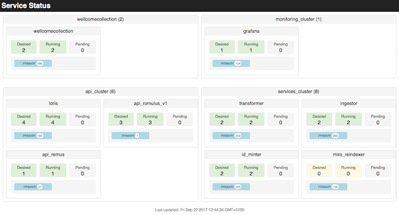
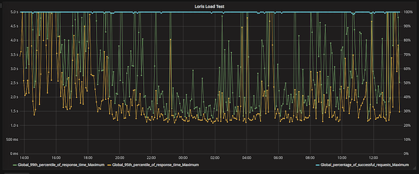
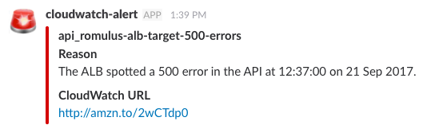

# monitoring

This directory has the source and Terraform code for our monitoring infrastructure.

## Services dashboard

We have a dashboard which reports the state of our ECS clusters.
For each cluster, it shows:

*   the number of registered EC2 instances
*   the registered services, and their desired/running/pending task counts
*   the running task definitions

The live dashboard can be viewed at <https://s3-eu-west-1.amazonaws.com/wellcome-platform-dash/index.html>.

## Grafana dashboard

We have a [Grafana][grafana] dashboard for monitoring load tests, queue sizes, and our AWS bill, among other things.

It can be viewed at <https://monitoring.wellcomecollection.org/> (note this is only accessible from within the Wellcome IP range).

[grafana]: https://grafana.com/

## Load tests

We run load tests with [Gatling][gatling], which tests the Catalogue API and Loris once every five minutes.
Results are published to an S3 bucket, and we have graphs in Grafana:

[gatling]: http://gatling.io/

## Slack alarms

We have an AWS Lambda that publishes certain CloudWatch alarms to a Slack channel, so failures are immediately visible.

